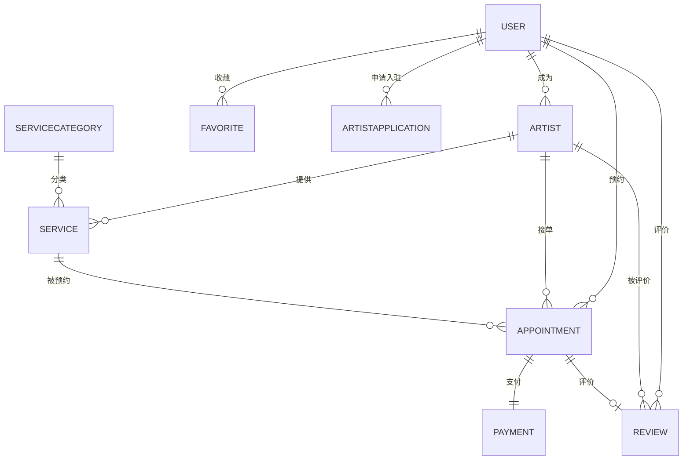

# Beauty Backend - 化妆师预约平台后端开发文档

## 项目概述

Beauty Backend 是一个化妆师预约平台的后端服务，提供用户管理、化妆师管理、服务预约、支付、评价等完整的业务功能。

### 技术栈

| 技术 | 版本 | 说明 |
|------|------|------|
| Java | 21 | 编程语言 |
| Spring Boot | 3.5.9 | 核心框架 |
| MyBatis Plus | 3.5.15 | ORM 框架 |
| MySQL | 8.x | 数据库 |
| Knife4j | 4.4.0 | API 文档 |
| Hutool | 5.8.43 | 工具库 |
| Lombok | 1.18.36 | 代码简化 |

---

## 快速开始

### 环境要求

- JDK 21+
- Maven 3.8+
- MySQL 8.0+

### 安装步骤

1. **克隆项目**
   ```bash
   git clone <repository-url>
   cd beauty-backend
   ```

2. **配置数据库**
   ```bash
   mysql -u root -p < sql/init.sql
   ```

3. **修改配置** (可选)
   
   编辑 `src/main/resources/application.yml`，修改数据库连接信息。

4. **启动项目**
   ```bash
   mvn spring-boot:run
   ```

5. **访问 API 文档**
   
   打开浏览器访问：`http://localhost:8124/api/doc.html`

---

## 统一响应格式

### 成功响应

```json
{
  "code": 0,
  "data": {},
  "message": "ok"
}
```

### 错误码说明

| 错误码 | 说明 |
|--------|------|
| 0 | 成功 |
| 40000 | 请求参数错误 |
| 40100 | 未登录 |
| 40101 | 无权限 |
| 40300 | 禁止访问 |
| 40400 | 请求数据不存在 |
| 50000 | 系统内部异常 |
| 50001 | 操作失败 |

---

## 一、用户端功能模块

> **Base URL**: `/api/user`

### 1.1 用户认证

#### 1.1.1 用户注册
- **POST** `/user/register`
- **描述**: 新用户注册账号
- **请求体**:
  ```json
  {
    "username": "string",      // 用户名（必填，唯一）
    "password": "string",      // 密码（必填，6-20位）
    "confirmPassword": "string", // 确认密码（必填）
    "phone": "string"          // 手机号（选填）
  }
  ```
- **响应**: `BaseResponse<Long>` 返回用户ID

#### 1.1.2 用户登录
- **POST** `/user/login`
- **描述**: 用户登录获取会话
- **请求体**:
  ```json
  {
    "username": "string",
    "password": "string"
  }
  ```
- **响应**: `BaseResponse<LoginUserVO>`
  ```json
  {
    "code": 0,
    "data": {
      "id": 1,
      "username": "user1",
      "nickname": "昵称",
      "phone": "138****5678",
      "email": "u***@example.com",
      "avatar": "https://...",
      "role": 0
    },
    "message": "ok"
  }
  ```

#### 1.1.3 用户登出
- **POST** `/user/logout`
- **描述**: 退出登录，清除会话
- **响应**: `BaseResponse<Boolean>`

#### 1.1.4 获取当前登录用户
- **GET** `/user/current`
- **描述**: 获取当前登录用户信息（已脱敏）
- **响应**: `BaseResponse<LoginUserVO>`

---

### 1.2 用户信息管理

#### 1.2.1 根据ID获取用户信息
- **GET** `/user/{id}`
- **描述**: 获取用户公开信息（已脱敏）
- **路径参数**: `id` - 用户ID
- **响应**: `BaseResponse<UserVO>`

#### 1.2.2 更新个人信息
- **PUT** `/user/update`
- **描述**: 更新当前登录用户信息
- **请求体**:
  ```json
  {
    "nickname": "string",
    "phone": "string",
    "email": "string",
    "avatar": "string"
  }
  ```
- **响应**: `BaseResponse<Boolean>`

---

### 1.3 化妆师入驻申请

#### 1.3.1 申请成为化妆师
- **POST** `/user/artist/apply`
- **描述**: 用户申请成为化妆师（需管理员审核）
- **请求体**:
  ```json
  {
    "realName": "string",           // 真实姓名（必填）
    "idCard": "string",             // 身份证号（选填）
    "phone": "string",              // 联系电话（必填）
    "experienceYears": 5,           // 从业年限
    "specialties": "新娘妆,日常妆",  // 擅长领域
    "certificateImages": ["url1"],  // 资质证书图片
    "portfolioImages": ["url1"],    // 作品集图片
    "introduction": "string"        // 个人介绍
  }
  ```
- **响应**: `BaseResponse<Long>` 返回申请ID

#### 1.3.2 查询我的申请状态
- **GET** `/user/artist/apply/status`
- **描述**: 查询当前用户的化妆师入驻申请状态
- **响应**: `BaseResponse<ArtistApplicationVO>`
  ```json
  {
    "code": 0,
    "data": {
      "id": 1,
      "status": 0,        // 0待审核 1通过 2拒绝
      "rejectReason": "", // 拒绝原因
      "createTime": "2026-01-15 10:00:00"
    }
  }
  ```

---

### 1.4 预约管理

#### 1.4.1 创建预约
- **POST** `/appointment/create`
- **描述**: 预约化妆师服务
- **请求体**:
  ```json
  {
    "artistId": 1,               // 化妆师ID（必填）
    "serviceId": 1,              // 服务套餐ID（必填）
    "appointmentDate": "2026-01-20", // 预约日期（必填）
    "appointmentTime": "10:00",  // 预约时间（必填）
    "address": "北京市朝阳区xxx", // 服务地址
    "contactName": "张三",       // 联系人姓名
    "contactPhone": "13812345678", // 联系电话
    "remark": "备注信息"         // 备注
  }
  ```
- **响应**: `BaseResponse<AppointmentVO>` 返回订单信息，包含 orderNo

#### 1.4.2 取消预约
- **POST** `/appointment/cancel/{id}`
- **描述**: 取消预约订单（仅限待支付/待确认状态）
- **路径参数**: `id` - 预约订单ID
- **请求体**:
  ```json
  {
    "cancelReason": "取消原因"
  }
  ```
- **响应**: `BaseResponse<Boolean>`

#### 1.4.3 修改预约时间
- **PUT** `/appointment/reschedule/{id}`
- **描述**: 修改预约时间（仅限待确认/已确认状态）
- **路径参数**: `id` - 预约订单ID
- **请求体**:
  ```json
  {
    "appointmentDate": "2026-01-21",
    "appointmentTime": "14:00"
  }
  ```
- **响应**: `BaseResponse<Boolean>`

#### 1.4.4 查询我的预约列表
- **GET** `/appointment/my/list`
- **描述**: 分页查询当前用户的预约订单
- **请求参数**:
  - `status` (选填): 订单状态筛选
  - `current`: 当前页码，默认1
  - `pageSize`: 每页数量，默认10
- **响应**: `BaseResponse<Page<AppointmentVO>>`

#### 1.4.5 查询预约详情
- **GET** `/appointment/{id}`
- **描述**: 查询预约订单详情
- **路径参数**: `id` - 预约订单ID
- **响应**: `BaseResponse<AppointmentDetailVO>`

---

### 1.5 支付功能

> **支付流程说明（模拟支付）**

```
┌─────────────┐    ┌─────────────┐    ┌─────────────┐    ┌─────────────┐
│  创建预约   │ -> │  获取支付   │ -> │  模拟支付   │ -> │  支付成功   │
│ (待支付)    │    │   订单信息  │    │  确认付款   │    │ (待确认)    │
└─────────────┘    └─────────────┘    └─────────────┘    └─────────────┘
       │                                                        │
       │                                                        ▼
       │                                                 ┌─────────────┐
       │                                                 │  化妆师确认  │
       │                                                 │  (已确认)   │
       │                                                 └─────────────┘
       │                                                        │
       ▼                                                        ▼
┌─────────────┐                                          ┌─────────────┐
│  取消订单   │                                          │  服务中     │
│ (已取消)    │                                          │  -> 已完成  │
└─────────────┘                                          └─────────────┘
```

**预约状态流转**:
- `0 待支付` → 用户支付后 → `1 待确认`
- `1 待确认` → 化妆师确认 → `2 已确认` / 化妆师拒绝 → `6 已拒绝`
- `2 已确认` → 到达服务时间 → `3 服务中`
- `3 服务中` → 服务完成 → `4 已完成`
- `0/1/2 任意状态` → 用户取消 → `5 已取消`

#### 1.5.1 获取支付信息
- **GET** `/payment/info/{appointmentId}`
- **描述**: 获取预约订单的支付信息
- **路径参数**: `appointmentId` - 预约订单ID
- **响应**: `BaseResponse<PaymentInfoVO>`
  ```json
  {
    "code": 0,
    "data": {
      "paymentNo": "PAY20260115100000001",
      "appointmentId": 1,
      "orderNo": "ORD20260115100000001",
      "amount": 299.00,
      "serviceName": "新娘妆全套",
      "artistName": "李化妆师",
      "status": 0  // 0待支付 1已支付 2已退款
    }
  }
  ```

#### 1.5.2 模拟支付
- **POST** `/payment/pay`
- **描述**: 模拟支付（无需真实支付）
- **请求体**:
  ```json
  {
    "paymentNo": "PAY20260115100000001",
    "paymentMethod": 3  // 1微信 2支付宝 3模拟支付
  }
  ```
- **响应**: `BaseResponse<PaymentResultVO>`
  ```json
  {
    "code": 0,
    "data": {
      "success": true,
      "paymentNo": "PAY20260115100000001",
      "tradeNo": "TRADE_20260115100000001",
      "paidAt": "2026-01-15 10:05:00",
      "message": "支付成功"
    }
  }
  ```

#### 1.5.3 查询支付状态
- **GET** `/payment/status/{paymentNo}`
- **描述**: 查询支付状态
- **路径参数**: `paymentNo` - 支付流水号
- **响应**: `BaseResponse<PaymentStatusVO>`

#### 1.5.4 申请退款
- **POST** `/payment/refund`
- **描述**: 申请退款（仅限已支付但未完成的订单）
- **请求体**:
  ```json
  {
    "paymentNo": "PAY20260115100000001",
    "refundReason": "退款原因"
  }
  ```
- **响应**: `BaseResponse<Boolean>`

---

### 1.6 收藏功能

#### 1.6.1 收藏化妆师
- **POST** `/favorite/artist/{artistId}`
- **描述**: 收藏化妆师
- **路径参数**: `artistId` - 化妆师ID
- **响应**: `BaseResponse<Boolean>`

#### 1.6.2 取消收藏化妆师
- **DELETE** `/favorite/artist/{artistId}`
- **描述**: 取消收藏化妆师
- **路径参数**: `artistId` - 化妆师ID
- **响应**: `BaseResponse<Boolean>`

#### 1.6.3 收藏服务套餐
- **POST** `/favorite/service/{serviceId}`
- **描述**: 收藏服务套餐
- **路径参数**: `serviceId` - 服务套餐ID
- **响应**: `BaseResponse<Boolean>`

#### 1.6.4 取消收藏服务套餐
- **DELETE** `/favorite/service/{serviceId}`
- **描述**: 取消收藏服务套餐
- **路径参数**: `serviceId` - 服务套餐ID
- **响应**: `BaseResponse<Boolean>`

#### 1.6.5 查询我的收藏列表
- **GET** `/favorite/my/list`
- **描述**: 查询当前用户的收藏列表
- **请求参数**:
  - `targetType` (选填): 收藏类型 1化妆师 2服务套餐
  - `current`: 当前页码
  - `pageSize`: 每页数量
- **响应**: `BaseResponse<Page<FavoriteVO>>`

#### 1.6.6 检查是否已收藏
- **GET** `/favorite/check`
- **描述**: 检查是否已收藏某个目标
- **请求参数**:
  - `targetType`: 收藏类型 1化妆师 2服务套餐
  - `targetId`: 目标ID
- **响应**: `BaseResponse<Boolean>`

---

### 1.7 评价功能

#### 1.7.1 提交评价
- **POST** `/review/create`
- **描述**: 对已完成的订单提交评价
- **请求体**:
  ```json
  {
    "appointmentId": 1,          // 预约订单ID（必填）
    "rating": 5,                 // 评分1-5（必填）
    "content": "服务很好，化妆效果满意！",
    "images": ["url1", "url2"]   // 评价图片
  }
  ```
- **响应**: `BaseResponse<Long>` 返回评价ID

#### 1.7.2 查看化妆师评价列表
- **GET** `/review/artist/{artistId}`
- **描述**: 查看化妆师的评价列表
- **路径参数**: `artistId` - 化妆师ID
- **请求参数**:
  - `current`: 当前页码
  - `pageSize`: 每页数量
- **响应**: `BaseResponse<Page<ReviewVO>>`

---

## 二、化妆师端功能模块

> **Base URL**: `/api/artist`  
> **权限要求**: 需要登录且用户角色为化妆师 (role=1)

### 2.1 预约管理

#### 2.1.1 查询待处理预约
- **GET** `/artist/appointment/pending`
- **描述**: 查询待确认的预约订单
- **请求参数**:
  - `current`: 当前页码
  - `pageSize`: 每页数量
- **响应**: `BaseResponse<Page<AppointmentVO>>`

#### 2.1.2 确认预约
- **POST** `/artist/appointment/confirm/{id}`
- **描述**: 确认预约订单
- **路径参数**: `id` - 预约订单ID
- **响应**: `BaseResponse<Boolean>`

#### 2.1.3 拒绝预约
- **POST** `/artist/appointment/reject/{id}`
- **描述**: 拒绝预约订单
- **路径参数**: `id` - 预约订单ID
- **请求体**:
  ```json
  {
    "rejectReason": "拒绝原因"
  }
  ```
- **响应**: `BaseResponse<Boolean>`

#### 2.1.4 查询我的订单列表
- **GET** `/artist/appointment/my/list`
- **描述**: 化妆师查询自己的所有订单
- **请求参数**:
  - `status` (选填): 订单状态筛选
  - `current`: 当前页码
  - `pageSize`: 每页数量
- **响应**: `BaseResponse<Page<AppointmentVO>>`

#### 2.1.5 开始服务
- **POST** `/artist/appointment/start/{id}`
- **描述**: 标记订单为服务中
- **路径参数**: `id` - 预约订单ID
- **响应**: `BaseResponse<Boolean>`

#### 2.1.6 完成服务
- **POST** `/artist/appointment/complete/{id}`
- **描述**: 标记订单为已完成
- **路径参数**: `id` - 预约订单ID
- **响应**: `BaseResponse<Boolean>`

---

### 2.2 服务套餐管理

#### 2.2.1 创建服务套餐
- **POST** `/artist/service/create`
- **描述**: 化妆师创建服务套餐
- **请求体**:
  ```json
  {
    "categoryId": 1,              // 分类ID
    "name": "新娘妆全套",         // 套餐名称
    "description": "包含试妆...", // 套餐描述
    "price": 2999.00,            // 价格
    "duration": 120,             // 服务时长（分钟）
    "coverImage": "url",         // 封面图片
    "images": ["url1", "url2"],  // 详情图片
    "sortOrder": 0               // 排序权重
  }
  ```
- **响应**: `BaseResponse<Long>` 返回服务套餐ID

#### 2.2.2 修改服务套餐
- **PUT** `/artist/service/update/{id}`
- **描述**: 修改服务套餐信息
- **路径参数**: `id` - 服务套餐ID
- **请求体**: 同创建，可只传需要修改的字段
- **响应**: `BaseResponse<Boolean>`

#### 2.2.3 上架/下架服务套餐
- **PUT** `/artist/service/status/{id}`
- **描述**: 修改服务套餐上架状态
- **路径参数**: `id` - 服务套餐ID
- **请求体**:
  ```json
  {
    "status": 1  // 0下架 1上架
  }
  ```
- **响应**: `BaseResponse<Boolean>`

#### 2.2.4 删除服务套餐
- **DELETE** `/artist/service/delete/{id}`
- **描述**: 删除服务套餐（逻辑删除）
- **路径参数**: `id` - 服务套餐ID
- **响应**: `BaseResponse<Boolean>`

#### 2.2.5 查询我的服务套餐列表
- **GET** `/artist/service/my/list`
- **描述**: 查询当前化妆师的所有服务套餐
- **请求参数**:
  - `status` (选填): 状态筛选 0下架 1上架
  - `current`: 当前页码
  - `pageSize`: 每页数量
- **响应**: `BaseResponse<Page<ServiceVO>>`

---

### 2.3 评价回复

#### 2.3.1 回复用户评价
- **POST** `/artist/review/reply/{id}`
- **描述**: 化妆师回复用户评价
- **路径参数**: `id` - 评价ID
- **请求体**:
  ```json
  {
    "reply": "感谢您的好评，期待下次为您服务！"
  }
  ```
- **响应**: `BaseResponse<Boolean>`

#### 2.3.2 查询我的评价列表
- **GET** `/artist/review/my/list`
- **描述**: 查询当前化妆师收到的所有评价
- **请求参数**:
  - `rating` (选填): 评分筛选
  - `current`: 当前页码
  - `pageSize`: 每页数量
- **响应**: `BaseResponse<Page<ReviewVO>>`

---

### 2.4 状态管理

#### 2.4.1 修改接单状态
- **PUT** `/artist/status/update`
- **描述**: 修改化妆师的接单状态
- **请求体**:
  ```json
  {
    "status": 1  // 0休息 1可接单
  }
  ```
- **响应**: `BaseResponse<Boolean>`

#### 2.4.2 获取个人主页信息
- **GET** `/artist/profile`
- **描述**: 获取化妆师个人主页信息
- **响应**: `BaseResponse<ArtistProfileVO>`

#### 2.4.3 更新个人信息
- **PUT** `/artist/profile/update`
- **描述**: 更新化妆师个人资料
- **请求体**:
  ```json
  {
    "title": "高级化妆师",
    "description": "个人简介...",
    "specialties": "新娘妆,晚宴妆",
    "portfolioImages": ["url1", "url2"],
    "basePrice": 299.00
  }
  ```
- **响应**: `BaseResponse<Boolean>`

---

### 2.5 时间管理

> 化妆师可以管理自己的可预约时间段，设置工作日程和休息日

#### 2.5.1 创建可预约时间段
- **POST** `/artist/schedule/create`
- **描述**: 创建可预约的时间段
- **请求体**:
  ```json
  {
    "date": "2026-01-20",           // 日期（必填）
    "startTime": "09:00",           // 开始时间（必填）
    "endTime": "18:00",             // 结束时间（必填）
    "slotDuration": 60,             // 时间槽时长（分钟），默认60
    "maxBookings": 1                // 每个时间槽最大预约数，默认1
  }
  ```
- **响应**: `BaseResponse<Long>` 返回时间段ID

#### 2.5.2 批量创建时间段
- **POST** `/artist/schedule/batch-create`
- **描述**: 批量创建多日的可预约时间段（如设置一周的时间）
- **请求体**:
  ```json
  {
    "startDate": "2026-01-20",      // 开始日期
    "endDate": "2026-01-26",        // 结束日期
    "weekdays": [1, 2, 3, 4, 5],    // 星期几可用 (1=周一, 7=周日)
    "startTime": "09:00",
    "endTime": "18:00",
    "slotDuration": 60,
    "maxBookings": 1
  }
  ```
- **响应**: `BaseResponse<Integer>` 返回创建的时间段数量

#### 2.5.3 设置休息日/不可用时间
- **POST** `/artist/schedule/block`
- **描述**: 设置某天或某时间段不可预约
- **请求体**:
  ```json
  {
    "date": "2026-01-22",           // 日期
    "startTime": "09:00",           // 开始时间（可选，不传则整天不可用）
    "endTime": "12:00",             // 结束时间（可选）
    "reason": "私人事务"             // 原因（可选）
  }
  ```
- **响应**: `BaseResponse<Boolean>`

#### 2.5.4 取消休息日
- **DELETE** `/artist/schedule/block/{id}`
- **描述**: 取消已设置的休息日/不可用时间
- **路径参数**: `id` - 不可用时间记录ID
- **响应**: `BaseResponse<Boolean>`

#### 2.5.5 查询我的日程
- **GET** `/artist/schedule/my`
- **描述**: 查询化妆师的日程安排（包含已有预约）
- **请求参数**:
  - `startDate`: 开始日期
  - `endDate`: 结束日期
- **响应**: `BaseResponse<List<ScheduleVO>>`
  ```json
  {
    "code": 0,
    "data": [
      {
        "date": "2026-01-20",
        "dayOfWeek": 1,
        "isBlocked": false,
        "blockReason": null,
        "timeSlots": [
          {
            "startTime": "09:00",
            "endTime": "10:00",
            "status": "available"  // available/booked/blocked
          },
          {
            "startTime": "10:00",
            "endTime": "11:00",
            "status": "booked",
            "appointment": {
              "id": 1,
              "orderNo": "ORD...",
              "userName": "张三"
            }
          }
        ]
      }
    ]
  }
  ```

#### 2.5.6 查询化妆师可预约时间（用户端）
- **GET** `/artist/{artistId}/available-times`
- **描述**: 用户查询化妆师的可预约时间段
- **路径参数**: `artistId` - 化妆师ID
- **请求参数**:
  - `date`: 查询日期
- **响应**: `BaseResponse<List<TimeSlotVO>>`
  ```json
  {
    "code": 0,
    "data": [
      { "time": "09:00", "available": true },
      { "time": "10:00", "available": false },
      { "time": "11:00", "available": true }
    ]
  }
  ```

#### 2.5.7 预约时间冲突检测
- **GET** `/appointment/check-conflict`
- **描述**: 创建预约前检测时间是否冲突
- **请求参数**:
  - `artistId`: 化妆师ID
  - `date`: 预约日期
  - `time`: 预约时间
  - `duration`: 服务时长（分钟）
- **响应**: `BaseResponse<ConflictCheckVO>`
  ```json
  {
    "code": 0,
    "data": {
      "hasConflict": false,
      "conflictReason": null,
      "suggestedTimes": ["14:00", "15:00", "16:00"]
    }
  }
  ```

---

## 三、管理端功能模块

> **Base URL**: `/api/admin`  
> **权限要求**: 需要登录且用户角色为管理员 (role=2)

### 3.1 用户管理

#### 3.1.1 创建用户
- **POST** `/admin/user/create`
- **描述**: 管理员创建新用户
- **请求体**:
  ```json
  {
    "username": "string",
    "password": "string",
    "nickname": "string",
    "phone": "string",
    "email": "string",
    "role": 0,    // 0用户 1化妆师 2管理员
    "status": 1   // 0禁用 1正常
  }
  ```
- **响应**: `BaseResponse<Long>` 返回用户ID

#### 3.1.2 修改用户信息
- **PUT** `/admin/user/update/{id}`
- **描述**: 修改用户信息
- **路径参数**: `id` - 用户ID
- **请求体**:
  ```json
  {
    "nickname": "string",
    "phone": "string",
    "email": "string",
    "role": 0,
    "status": 1
  }
  ```
- **响应**: `BaseResponse<Boolean>`

#### 3.1.3 查询用户列表
- **GET** `/admin/user/list`
- **描述**: 分页查询用户列表
- **请求参数**:
  - `username` (选填): 用户名模糊搜索
  - `phone` (选填): 手机号模糊搜索
  - `role` (选填): 角色筛选
  - `status` (选填): 状态筛选
  - `current`: 当前页码
  - `pageSize`: 每页数量
- **响应**: `BaseResponse<Page<UserVO>>`

#### 3.1.4 修改用户状态
- **PUT** `/admin/user/status/{id}`
- **描述**: 修改用户状态（启用/禁用）
- **路径参数**: `id` - 用户ID
- **请求体**:
  ```json
  {
    "status": 1  // 0禁用 1正常
  }
  ```
- **响应**: `BaseResponse<Boolean>`

#### 3.1.5 删除用户
- **DELETE** `/admin/user/delete/{id}`
- **描述**: 删除用户（逻辑删除）
- **路径参数**: `id` - 用户ID
- **响应**: `BaseResponse<Boolean>`

---

### 3.2 化妆师管理

#### 3.2.1 查询化妆师详情
- **GET** `/admin/artist/{id}`
- **描述**: 查询化妆师详细信息
- **路径参数**: `id` - 化妆师ID
- **响应**: `BaseResponse<ArtistDetailVO>`

#### 3.2.2 查询化妆师列表
- **GET** `/admin/artist/list`
- **描述**: 分页查询化妆师列表
- **请求参数**:
  - `realName` (选填): 真实姓名模糊搜索
  - `status` (选填): 状态筛选 0休息 1可接单
  - `isRecommend` (选填): 是否推荐筛选
  - `current`: 当前页码
  - `pageSize`: 每页数量
- **响应**: `BaseResponse<Page<ArtistVO>>`

#### 3.2.3 修改化妆师信息
- **PUT** `/admin/artist/update/{id}`
- **描述**: 修改化妆师信息
- **路径参数**: `id` - 化妆师ID
- **请求体**:
  ```json
  {
    "title": "string",
    "description": "string",
    "experienceYears": 5,
    "specialties": "string",
    "basePrice": 299.00
  }
  ```
- **响应**: `BaseResponse<Boolean>`

#### 3.2.4 设置推荐化妆师
- **PUT** `/admin/artist/recommend/{id}`
- **描述**: 设置是否推荐化妆师
- **路径参数**: `id` - 化妆师ID
- **请求体**:
  ```json
  {
    "isRecommend": 1  // 0否 1是
  }
  ```
- **响应**: `BaseResponse<Boolean>`

#### 3.2.5 修改化妆师状态
- **PUT** `/admin/artist/status/{id}`
- **描述**: 修改化妆师接单状态
- **路径参数**: `id` - 化妆师ID
- **请求体**:
  ```json
  {
    "status": 1  // 0休息 1可接单
  }
  ```
- **响应**: `BaseResponse<Boolean>`

---

### 3.3 化妆师入驻审核

#### 3.3.1 查询待审核申请列表
- **GET** `/admin/artist/application/list`
- **描述**: 分页查询化妆师入驻申请
- **请求参数**:
  - `status` (选填): 状态筛选 0待审核 1通过 2拒绝
  - `current`: 当前页码
  - `pageSize`: 每页数量
- **响应**: `BaseResponse<Page<ArtistApplicationVO>>`

#### 3.3.2 查询申请详情
- **GET** `/admin/artist/application/{id}`
- **描述**: 查询化妆师入驻申请详情
- **路径参数**: `id` - 申请ID
- **响应**: `BaseResponse<ArtistApplicationDetailVO>`

#### 3.3.3 审核通过
- **POST** `/admin/artist/application/approve/{id}`
- **描述**: 审核通过化妆师入驻申请
- **路径参数**: `id` - 申请ID
- **响应**: `BaseResponse<Boolean>`
- **说明**: 审核通过后，自动将用户角色改为化妆师(role=1)，并创建化妆师记录

#### 3.3.4 审核拒绝
- **POST** `/admin/artist/application/reject/{id}`
- **描述**: 拒绝化妆师入驻申请
- **路径参数**: `id` - 申请ID
- **请求体**:
  ```json
  {
    "rejectReason": "拒绝原因"
  }
  ```
- **响应**: `BaseResponse<Boolean>`

---

### 3.4 订单管理

#### 3.4.1 查询订单列表
- **GET** `/admin/appointment/list`
- **描述**: 分页查询所有预约订单
- **请求参数**:
  - `orderNo` (选填): 订单号搜索
  - `userId` (选填): 用户ID筛选
  - `artistId` (选填): 化妆师ID筛选
  - `status` (选填): 状态筛选
  - `appointmentDate` (选填): 预约日期筛选
  - `current`: 当前页码
  - `pageSize`: 每页数量
- **响应**: `BaseResponse<Page<AppointmentVO>>`

#### 3.4.2 查询订单详情
- **GET** `/admin/appointment/{id}`
- **描述**: 查询预约订单详情
- **路径参数**: `id` - 订单ID
- **响应**: `BaseResponse<AppointmentDetailVO>`
  ```json
  {
    "code": 0,
    "data": {
      "id": 1,
      "orderNo": "ORD20260115100000001",
      "user": { "id": 1, "username": "user1", "phone": "138****5678" },
      "artist": { "id": 1, "realName": "李化妆师" },
      "service": { "id": 1, "name": "新娘妆全套", "price": 2999.00 },
      "appointmentDate": "2026-01-20",
      "appointmentTime": "10:00",
      "address": "北京市朝阳区xxx",
      "contactName": "张三",
      "contactPhone": "13812345678",
      "totalAmount": 2999.00,
      "status": 2,
      "payment": { "paymentNo": "PAY...", "status": 1, "paidAt": "..." },
      "createTime": "2026-01-15 10:00:00"
    }
  }
  ```

---

### 3.5 评价管理

#### 3.5.1 查询评价列表
- **GET** `/admin/review/list`
- **描述**: 分页查询所有评价
- **请求参数**:
  - `userId` (选填): 用户ID筛选
  - `artistId` (选填): 化妆师ID筛选
  - `rating` (选填): 评分筛选
  - `status` (选填): 状态筛选 0隐藏 1显示
  - `current`: 当前页码
  - `pageSize`: 每页数量
- **响应**: `BaseResponse<Page<ReviewVO>>`

#### 3.5.2 删除评价
- **DELETE** `/admin/review/delete/{id}`
- **描述**: 删除评价（逻辑删除）
- **路径参数**: `id` - 评价ID
- **响应**: `BaseResponse<Boolean>`

#### 3.5.3 隐藏/显示评价
- **PUT** `/admin/review/status/{id}`
- **描述**: 修改评价显示状态
- **路径参数**: `id` - 评价ID
- **请求体**:
  ```json
  {
    "status": 1  // 0隐藏 1显示
  }
  ```
- **响应**: `BaseResponse<Boolean>`

---

### 3.6 服务分类管理

#### 3.6.1 创建服务分类
- **POST** `/admin/category/create`
- **请求体**:
  ```json
  {
    "name": "新娘妆",
    "icon": "url",
    "sortOrder": 1
  }
  ```
- **响应**: `BaseResponse<Long>`

#### 3.6.2 修改服务分类
- **PUT** `/admin/category/update/{id}`
- **响应**: `BaseResponse<Boolean>`

#### 3.6.3 删除服务分类
- **DELETE** `/admin/category/delete/{id}`
- **响应**: `BaseResponse<Boolean>`

#### 3.6.4 查询服务分类列表
- **GET** `/admin/category/list`
- **响应**: `BaseResponse<List<ServiceCategoryVO>>`

---

### 3.7 轮播图管理

#### 3.7.1 创建轮播图
- **POST** `/admin/banner/create`
- **请求体**:
  ```json
  {
    "title": "新春特惠",
    "imageUrl": "url",
    "linkUrl": "/activity/1",
    "sortOrder": 1
  }
  ```
- **响应**: `BaseResponse<Long>`

#### 3.7.2 修改轮播图
- **PUT** `/admin/banner/update/{id}`
- **响应**: `BaseResponse<Boolean>`

#### 3.7.3 删除轮播图
- **DELETE** `/admin/banner/delete/{id}`
- **响应**: `BaseResponse<Boolean>`

#### 3.7.4 查询轮播图列表
- **GET** `/admin/banner/list`
- **响应**: `BaseResponse<List<BannerVO>>`

---

### 3.8 数据统计

#### 3.8.1 获取统计总览
- **GET** `/admin/statistics/overview`
- **描述**: 获取平台数据总览
- **响应**: `BaseResponse<StatisticsOverviewVO>`
  ```json
  {
    "code": 0,
    "data": {
      "totalUsers": 1000,         // 总用户数
      "totalArtists": 50,         // 总化妆师数
      "totalOrders": 500,         // 总订单数
      "totalRevenue": 150000.00,  // 总收入
      "todayOrders": 10,          // 今日订单数
      "todayRevenue": 5000.00,    // 今日收入
      "pendingApplications": 5,   // 待审核申请数
      "pendingOrders": 8          // 待确认订单数
    }
  }
  ```

#### 3.8.2 获取订单统计
- **GET** `/admin/statistics/orders`
- **描述**: 获取订单统计数据
- **请求参数**:
  - `type`: 统计类型 `day`/`week`/`month`
  - `startDate` (选填): 开始日期
  - `endDate` (选填): 结束日期
- **响应**: `BaseResponse<OrderStatisticsVO>`
  ```json
  {
    "code": 0,
    "data": {
      "type": "week",
      "items": [
        { "date": "2026-01-13", "orderCount": 15, "revenue": 8000.00 },
        { "date": "2026-01-14", "orderCount": 20, "revenue": 12000.00 },
        { "date": "2026-01-15", "orderCount": 18, "revenue": 9500.00 }
      ],
      "totalOrderCount": 53,
      "totalRevenue": 29500.00,
      "avgOrderAmount": 556.60,
      "orderStatusDistribution": {
        "completed": 45,
        "canceled": 5,
        "refunded": 3
      }
    }
  }
  ```

#### 3.8.3 获取化妆师排行榜
- **GET** `/admin/statistics/artists/ranking`
- **描述**: 获取化妆师排行榜
- **请求参数**:
  - `type`: 排行类型 `rating`/`orders`/`revenue`
  - `limit`: 返回数量，默认10
- **响应**: `BaseResponse<List<ArtistRankingVO>>`
  ```json
  {
    "code": 0,
    "data": [
      {
        "rank": 1,
        "artistId": 1,
        "realName": "李化妆师",
        "avatar": "url",
        "rating": 4.9,
        "orderCount": 120,
        "revenue": 50000.00
      },
      {
        "rank": 2,
        "artistId": 2,
        "realName": "王化妆师",
        "avatar": "url",
        "rating": 4.8,
        "orderCount": 100,
        "revenue": 45000.00
      }
    ]
  }
  ```

#### 3.8.4 获取用户增长趋势
- **GET** `/admin/statistics/users/trend`
- **描述**: 获取用户注册增长趋势
- **请求参数**:
  - `type`: 统计类型 `day`/`week`/`month`
  - `days`: 统计天数，默认30
- **响应**: `BaseResponse<List<TrendItemVO>>`
  ```json
  {
    "code": 0,
    "data": [
      { "date": "2026-01-01", "count": 10 },
      { "date": "2026-01-02", "count": 15 },
      { "date": "2026-01-03", "count": 8 }
    ]
  }
  ```

#### 3.8.5 获取热门服务统计
- **GET** `/admin/statistics/services/hot`
- **描述**: 获取热门服务套餐统计
- **请求参数**:
  - `limit`: 返回数量，默认10
- **响应**: `BaseResponse<List<HotServiceVO>>`
  ```json
  {
    "code": 0,
    "data": [
      {
        "serviceId": 1,
        "serviceName": "新娘妆全套",
        "categoryName": "新娘妆",
        "artistName": "李化妆师",
        "orderCount": 50,
        "revenue": 149500.00
      }
    ]
  }
  ```

---

## 数据库设计

### ER 图



### 数据表说明

| 表名 | 说明 |
|------|------|
| `user` | 用户表 (id, username, password, phone, role, status) |
| `artist` | 化妆师表 (id, userId, realName, title, rating, basePrice, status, isRecommend) |
| `serviceCategory` | 服务分类表 (id, name, icon, sortOrder) |
| `service` | 服务套餐表 (id, artistId, categoryId, name, price, duration, status) |
| `appointment` | 预约订单表 (id, orderNo, userId, artistId, serviceId, appointmentDate, status) |
| `payment` | 支付记录表 (id, appointmentId, paymentNo, amount, status, paymentMethod) |
| `favorite` | 收藏表 (id, userId, targetType, targetId) |
| `review` | 评价表 (id, appointmentId, userId, artistId, rating, content, reply) |
| `artistApplication` | 化妆师入驻申请表 (id, userId, realName, status, rejectReason) |
| `banner` | 轮播图表 (id, title, imageUrl, linkUrl, sortOrder) |
| `systemSetting` | 系统设置表 (id, settingKey, settingValue) |

### 功能与数据库表映射验证

> 以下是所有 API 功能与数据库表的对应关系，确保后续开发时不需要额外修改数据库结构。

| 功能模块 | API | 对应数据库表 | 涉及字段 |
|----------|-----|-------------|----------|
| **用户注册** | `POST /user/register` | `user` | username, password, phone, role, status |
| **用户登录** | `POST /user/login` | `user` | username, password |
| **用户信息** | `GET/PUT /user/*` | `user` | nickname, phone, email, avatar |
| **化妆师入驻申请** | `POST /user/artist/apply` | `artistApplication` | userId, realName, idCard, phone, experienceYears, specialties, certificateImages, portfolioImages, introduction, status |
| **查询申请状态** | `GET /user/artist/apply/status` | `artistApplication` | status, rejectReason, createTime |
| **创建预约** | `POST /appointment/create` | `appointment` + `payment` | orderNo, userId, artistId, serviceId, appointmentDate, appointmentTime, address, contactName, contactPhone, remark, totalAmount, status |
| **查询我的订单** | `GET /appointment/my/list` | `appointment` | 通过 userId 查询 |
| **取消预约** | `POST /appointment/cancel/{id}` | `appointment` | status, cancelReason |
| **修改预约时间** | `PUT /appointment/reschedule/{id}` | `appointment` | appointmentDate, appointmentTime |
| **获取支付信息** | `GET /payment/info/{appointmentId}` | `payment` + `appointment` | paymentNo, amount, status |
| **模拟支付** | `POST /payment/pay` | `payment` | paymentNo, paymentMethod, status, paidAt, tradeNo |
| **申请退款** | `POST /payment/refund` | `payment` | status, refundAt, refundReason |
| **收藏化妆师** | `POST /favorite/artist/{artistId}` | `favorite` | userId, targetType=1, targetId |
| **收藏服务套餐** | `POST /favorite/service/{serviceId}` | `favorite` | userId, targetType=2, targetId |
| **查询收藏列表** | `GET /favorite/my/list` | `favorite` | 通过 userId, targetType 查询 |
| **提交评价** | `POST /review/create` | `review` | appointmentId, userId, artistId, rating, content, images |
| **查看评价** | `GET /review/artist/{artistId}` | `review` | 通过 artistId 查询 |
| **化妆师确认/拒绝预约** | `POST /artist/appointment/*` | `appointment` | status, cancelReason |
| **创建服务套餐** | `POST /artist/service/create` | `service` | artistId, categoryId, name, description, price, duration, coverImage, images, sortOrder |
| **修改服务套餐** | `PUT /artist/service/update/{id}` | `service` | name, description, price, duration, coverImage, images, status |
| **回复用户评价** | `POST /artist/review/reply/{id}` | `review` | reply, replyTime |
| **修改接单状态** | `PUT /artist/status/update` | `artist` | status (0休息/1可接单) |
| **更新化妆师资料** | `PUT /artist/profile/update` | `artist` | title, description, specialties, portfolioImages, basePrice |
| **管理员用户管理** | `/admin/user/*` | `user` | 全部字段 |
| **管理员化妆师管理** | `/admin/artist/*` | `artist` | 全部字段 |
| **设置推荐化妆师** | `PUT /admin/artist/recommend/{id}` | `artist` | isRecommend |
| **审核入驻申请** | `POST /admin/artist/application/*` | `artistApplication` + `user` + `artist` | status, rejectReason, reviewedBy, reviewedAt; 审核通过时更新 user.role=1 并插入 artist 记录 |
| **订单管理** | `/admin/appointment/*` | `appointment` + `payment` | 全部字段 |
| **评价管理** | `/admin/review/*` | `review` | status, isDeleted |
| **服务分类管理** | `/admin/category/*` | `serviceCategory` | name, icon, sortOrder, status |
| **轮播图管理** | `/admin/banner/*` | `banner` | title, imageUrl, linkUrl, sortOrder, status |
| **数据统计** | `/admin/statistics/*` | 聚合查询 | 从 user, artist, appointment, payment, service 等表聚合统计 |

### 时间管理功能说明

> ⚠️ **注意**: 化妆师时间管理模块 (2.5节) 需要新增数据库表，建议后续新建 `artistSchedule` 表来存储化妆师的可用时间段。

**建议的表结构**:
```sql
CREATE TABLE `artistSchedule` (
    `id` BIGINT NOT NULL AUTO_INCREMENT COMMENT '主键',
    `artistId` BIGINT NOT NULL COMMENT '化妆师ID',
    `date` DATE NOT NULL COMMENT '日期',
    `startTime` TIME NOT NULL COMMENT '开始时间',
    `endTime` TIME NOT NULL COMMENT '结束时间',
    `isBlocked` TINYINT NOT NULL DEFAULT 0 COMMENT '是否不可用: 0可用 1不可用',
    `blockReason` VARCHAR(255) DEFAULT NULL COMMENT '不可用原因',
    `createTime` DATETIME NOT NULL DEFAULT CURRENT_TIMESTAMP,
    `updateTime` DATETIME NOT NULL DEFAULT CURRENT_TIMESTAMP ON UPDATE CURRENT_TIMESTAMP,
    `isDeleted` TINYINT NOT NULL DEFAULT 0 COMMENT '逻辑删除',
    PRIMARY KEY (`id`),
    KEY `idx_artistId` (`artistId`),
    KEY `idx_date` (`date`)
) ENGINE=InnoDB DEFAULT CHARSET=utf8mb4 COMMENT='化妆师日程表';
```

---

## 开发规范

### 分层架构

```
Controller (接口层) - 参数校验、调用 Service
     ↓
Service (业务层) - 业务逻辑实现
     ↓
Mapper (数据访问层) - 数据库操作
     ↓
Database (数据库)
```

### 数据模型

| 类型 | 说明 | 命名规范 |
|------|------|----------|
| Entity | 数据库实体 | `User.java` |
| DTO | 请求参数对象 | `UserLoginRequest.java` |
| VO | 响应视图对象 | `UserVO.java` |

### 权限控制

| 路由前缀 | 权限要求 |
|----------|----------|
| `/api/user/*` | 部分需登录 |
| `/api/artist/*` | 需登录 + 化妆师角色 |
| `/api/admin/*` | 需登录 + 管理员角色 |

---

## 部署指南

### 打包

```bash
mvn clean package -DskipTests
```

### 运行

```bash
java -jar target/beauty-backend-0.0.1-SNAPSHOT.jar
```

### Docker 部署

```dockerfile
FROM openjdk:21-slim
COPY target/beauty-backend-0.0.1-SNAPSHOT.jar app.jar
EXPOSE 8124
ENTRYPOINT ["java", "-jar", "/app.jar"]
```

---

## License

MIT License
